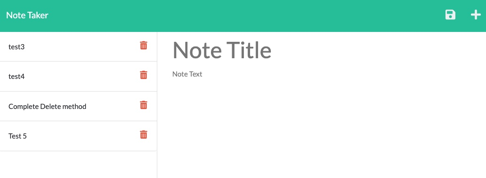

 

   

  # Note Taker

  ## Description 
  The Note Taker website allows users to document and track important thoughts. From to-do lists to big ideas, Note Taker is an easy way to document and track your notes. 

  ## Table of Contents

  * [Installation](#Installation)
  * [Usage](#Usage)
  * [Contributions](#Contributions)
  * [Testing](#Testing)
  * [License](#License)
  * [Questions](#Questions)

  ## Installation
  Simply visit the website and begin notating. 
 https://secret-hamlet-22284.herokuapp.com/
 

  ## Usage
  To document and track to-do lists or ideas.

  ## Contributions
  No contributions.

  ## Testing 
  Document a test note and click the save icon to ensure your notes are saving.

  ## License 
  This project has an MIT license.
  https://opensource.org/licenses/MIT

 
  

  ## Questions
  Need to reach me?
  * Email: michvalenz27@gmail.com
  * [GitHub](https://github.com/MichValenz)

       